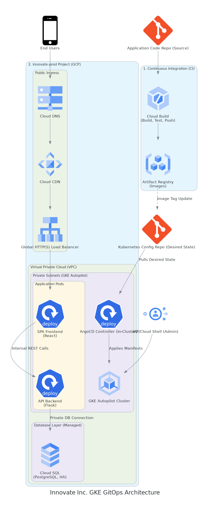

# Architectural Design – Innovate Inc

Below is a practical, real-world cloud architecture for Innovate Inc. A startup aiming to grow fast, avoid overspending, and minimize time spent on infrastructure. This is based on hands-on experience with GKE deployments in small teams.

**Recommendation:** Google Cloud Platform (GCP) with Google Kubernetes Engine (GKE) is the simplest way to get started for a team that doesn't want to wrestle with AWS IAM or manual cluster management.

## Why GCP/GKE?

- **Google Kubernetes Engine** – GKE is the most polished managed Kubernetes. The team doesn't need to learn EKS/AKS quirks, and the GCP console is beginner-friendly.
- **Cost control** – GCP is often cheaper for startups (especially with startup credits and sustained use discounts). Autopilot means you pay only for what you use — not for idle nodes.
- **Managed services** – Cloud SQL, Artifact Registry, Cloud Build: all ready to go, no need to run your own databases or registries. This saves time and headaches.

## Environment Structure (GCP)

I recommend a classic split: separate projects for admin, dev, staging, and prod. This works—it's easier to separate permissions, costs, and avoid accidents. Real story: once, due to no dev/prod separation, someone pushed test data into the production database. Since then—always separate projects!

| GCP Project Name | Purpose | Justification |
| :--- | :--- | :--- |
| **`innovate-org-admin`** | Central administrative tasks, billing control, IAM. **No workload deployment.** | Provides the highest level of isolation for core governance, security, and billing, reducing the blast radius of a security event. |
| **`innovate-dev`** | Development and testing environment. | Isolates development workloads from production, allowing developers to iterate quickly without impacting live users. Costs are separate and typically lower. |
| **`innovate-staging`** | Pre-production environment for final QA, performance, and security testing. | Ensures changes are thoroughly validated against a production-like environment before deployment to `prod`. |
| **`innovate-prod`** | Production environment hosting the live web application and database. | Provides maximum security and performance isolation for sensitive user data and business-critical operations. |

You can generate the project structure using ready-made Terraform modules:

- [terraform-google-modules/bootstrap/google](https://github.com/terraform-google-modules/bootstrap/google)
- [terraform-google-modules/terraform-google-folders](https://github.com/terraform-google-modules/terraform-google-folders)
- [terraform-google-modules/terraform-google-project-factory](https://github.com/terraform-google-modules/terraform-google-project-factory)

## Network (VPC)

One VPC per project, with service-specific subnets. This gives you better isolation, clearer network policies, and easier management—each environment has its own network perimeter.

### Networking

#### VPC architecture – per project

- **Region:** Pick the one closest to your users (e.g., europe-west4 for Poland).
- **VPC per project:** Each project (dev, staging, prod) gets its own VPC. This prevents accidental cross-project traffic and simplifies firewall rules.
- **Service subnets:** Within each VPC, create separate subnets for different services:
  - **GKE subnet:** Hosts the Kubernetes cluster (primary and secondary CIDR for pod networking).
  - **Cloud SQL subnet:** Private subnet for managed databases (private IP only).
  - **Load Balancer subnet:** For ingress controllers and load balancers (can share with GKE or separate).
  - **Shared services subnet:** Optional, for any other services (caching, monitoring agents, etc.).
- **Cross-project peering:** If needed, use VPC peering or Shared VPC for controlled cross-project communication (e.g., shared DNS, logging).

#### Network security

- **Firewall rules per VPC:** Each VPC has its own firewall rules, applied per subnet. This isolates failure domains.
  - **Ingress:** Only 443 (HTTPS) from the internet to the LB subnet.
  - **Between subnets:** Allow GKE → Cloud SQL (port 5432), GKE → shared services, etc. Deny by default, allow explicitly.
  - **Egress:** GKE nodes can reach the internet (for image pulls, updates) and internal services. Restrict if needed.
- **Cloud Armor:** Protect the load balancer from common attacks (DDoS, SQLi, etc.).
- **Private IPs only:** All services use private IPs within their VPCs. No public addresses on compute or database instances.
- **Admin access:** Use IAP (Identity-Aware Proxy) for SSH/RDP to instances, if needed at all. No bastions, no public keys floating around.
- **VPC Service Controls:** For prod, consider creating a security perimeter to prevent accidental data exfiltration.

You can set up the network with ready-made Terraform modules:

- [terraform-google-modules/terraform-google-network](https://github.com/terraform-google-modules/terraform-google-network)
- [terraform-google-modules/terraform-google-cloud-nat](https://github.com/terraform-google-modules/terraform-google-cloud-nat)
- [terraform-google-modules/terraform-google-address](https://github.com/terraform-google-modules/terraform-google-address)
- [terraform-google-modules/terraform-google-bastion-host](https://github.com/terraform-google-modules/terraform-google-bastion-host)
- [terraform-google-modules/terraform-google-lb-http](https://github.com/terraform-google-modules/terraform-google-lb-http)
- [GoogleCloudPlatform/terraform-google-cloud-armor](https://github.com/GoogleCloudPlatform/terraform-google-cloud-armor)

## Compute Platform (GKE)

### GKE Autopilot – zero admin overhead

Everything runs on GKE Autopilot. Google handles all the infrastructure underneath. You don't need to worry about nodes, patches, or scaling. You pay only for what actually runs (CPU, RAM for pods). It's perfect for startups.

### Scaling and resources

- **Node groups:** You don't manage them — GKE does it for you.
- **HPA:** Set up for API/Frontend, scale by CPU/RPS.
- **Cluster Autoscaler:** Works in the background, no need to worry.
- **Resource requests/limits:** Always set them to avoid surprises with RAM/CPU shortages.

Terraform module for GKE:

- [terraform-google-modules/terraform-google-kubernetes-engine](https://github.com/terraform-google-modules/terraform-google-kubernetes-engine)

### Containerization and CI/CD

- **Dockerfile:** Flask backend and React frontend—multi-stage build for small images.
- **Cloud Build:** Automatic builds on commit.
- **Artifact Registry:** Private registry, versioned images (e.g., `backend:v1.0.0`).
- **CD:** FluxCD or ArgoCD pipeline: build → push → tests → promote → rollout to GKE. GitOps = fewer accidental deploys.

## Database (PostgreSQL)

### Cloud SQL

Cloud SQL for PostgreSQL is the optimal choice.

It is a fully managed relational database service that handles patching, backups, replication, and scaling automatically. This significantly reduces the operational burden on a small startup while providing the necessary performance and reliability for a growing application with sensitive data.

### Backup, HA, DR

- **HA:** Enabled. You get a standby in another AZ, failover is automatic.
- **Backup:** Daily, 7-day retention, PITR (binlogs)—you can always roll back to any point.
- **DR:** Cross-region read replica—if a region goes down, promote and keep going.
- **Security:** Private IP only, access only from GKE via firewall. Further improvements can be done with proxy solutions and enforcing SSL.

## Architecture diagram

